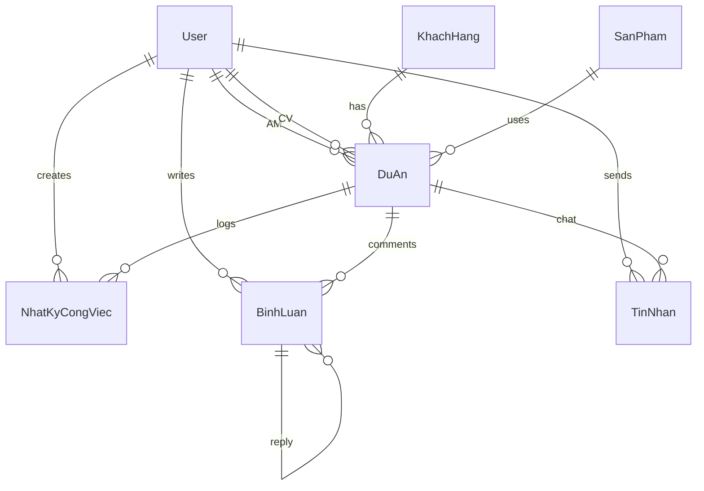

# Database Design — MobiFone Project Tracker
**Version:** 1.1.0 | **Updated:** 2026-04-04  
**ORM:** Prisma v7.6.x | **Database:** SQLite (dev) → PostgreSQL (prod)

---

## 1. Entity Relationship Diagram



---

## 2. Enums

```prisma
enum UserRole {
  ADMIN        // Quản trị viên
  AM           // Account Manager
  CV           // Chuyên viên
  USER         // Nhân viên (Legacy)
}

enum PhanLoaiKH {
  CHINH_PHU    // Sở, Ban, Ngành
  DOANH_NGHIEP // Doanh nghiệp tư nhân
  CONG_AN      // Công an (B2A)
}

enum TrangThaiDuAn {
  MOI              // Mới
  DANG_LAM_VIEC    // Đang làm việc
  DA_DEMO          // Đã demo
  DA_GUI_BAO_GIA   // Đã gửi báo giá
  DA_KY_HOP_DONG   // Đã ký hợp đồng
  THAT_BAI         // Thất bại
}

enum LinhVuc {
  CHINH_PHU      // Chính phủ/ Sở ban ngành
  DOANH_NGHIEP   // Doanh nghiệp
  CONG_AN        // Công an
}

enum LoaiTinNhan {
  TEXT       // Tin nhắn văn bản
  SYSTEM     // Tin nhắn hệ thống (status changed, user joined...)
}
```

---

## 3. Table Definitions

### 3.1 User (Nhân viên)

| Field | Type | Constraints | Description |
|-------|------|-------------|-------------|
| id | String | PK, cuid() | Unique identifier |
| name | String | required | Họ tên |
| email | String | unique | Email đăng nhập |
| hashedPassword | String | required | Mật khẩu mã hóa |
| role | UserRole | default: USER | Vai trò |
| diaBan | String? | nullable | Tổ 1, Tổ 2... |
| avatarUrl | String? | nullable | Ảnh đại diện |
| isActive | Boolean | default: true | Trạng thái tài khoản |
| createdAt | DateTime | auto | |
| updatedAt | DateTime | auto | |

**Indexes:** `email`, `role`, `diaBan`

### 3.2 Session (Better Auth)

| Field | Type | Constraints | Description |
|-------|------|-------------|-------------|
| id | String | PK | Session ID |
| userId | String | FK → User | User sở hữu |
| token | String | unique | Session token |
| expiresAt | DateTime | required | Hết hạn |

### 3.3 KhachHang (Khách hàng — Master Data)

| Field | Type | Constraints | Description |
|-------|------|-------------|-------------|
| id | Int | PK, auto | |
| ten | String | required | Sở Y tế, Bệnh viện... |
| phanLoai | PhanLoaiKH | required | Chính phủ / DN / Công an |
| diaChi | String? | nullable | Địa chỉ |
| soDienThoai | String? | nullable | SĐT |
| email | String? | nullable | Email liên hệ |
| dauMoiTiepCan | String? | nullable | Đầu mối tiếp cận |
| soDienThoaiDauMoi | String? | nullable | SĐT Đầu mối |
| ngaySinhDauMoi | DateTime? | nullable | Ngày sinh Đầu mối |
| lanhDaoDonVi | String? | nullable | Lãnh đạo đơn vị |
| soDienThoaiLanhDao | String? | nullable | SĐT Lãnh đạo |
| ngaySinhLanhDao | DateTime? | nullable | Ngày sinh Lãnh đạo |
| ngayThanhLap | DateTime? | nullable | Ngày thành lập |
| ngayKyNiem | DateTime? | nullable | Ngày kỷ niệm |
| ghiChu | String? | nullable | Ghi chú thêm |
| isActive | Boolean | default: true | |

**Indexes:** `phanLoai`, `ten`

### 3.4 SanPham (Sản phẩm — Master Data)

| Field | Type | Constraints | Description |
|-------|------|-------------|-------------|
| id | Int | PK, auto | |
| nhom | String | required | Cloud, IOC, Hóa đơn ĐT... |
| tenChiTiet | String | required | Tên chi tiết |
| moTa | String? | nullable | Mô tả |
| isActive | Boolean | default: true | |

**Indexes:** `nhom`

### 3.5 DuAn (Project Master — CORE)

| ID | Type | Constraints | Description |
|-------|------|-------------|-------------|
| id | Int | PK, auto | |
| customerId | Int | FK → KhachHang | Khách hàng |
| productId | Int | FK → SanPham | Sản phẩm |
| amId | String? | FK → User (SetNull) | AM phụ trách |
| amHoTroId | String? | FK → User (SetNull) | AM Hỗ trợ |
| chuyenVienId | String? | FK → User (SetNull) | Chuyên viên |
| cvHoTro1Id | String? | FK → User (SetNull) | Chuyên viên hỗ trợ 1 |
| cvHoTro2Id | String? | FK → User (SetNull) | Chuyên viên hỗ trợ 2 |
| tenDuAn | String | required | Tên mô tả dự án |
| linhVuc | LinhVuc | default: CHINH_PHU | Lĩnh vực |
| tongDoanhThuDuKien | Float | default: 0 | Triệu đồng |
| doanhThuTheoThang | Float? | default: 0 | Mức doanh thu tháng |
| maHopDong | String? | nullable | Mã hợp đồng |
| ngayBatDau | DateTime | required | Ngày bắt đầu |
| ngayKetThuc | DateTime? | nullable | Ngày kết thúc |
| isTrongDiem | Boolean | default: false | Dự án trọng điểm |
| isPendingDelete | Boolean | default: false | Cờ xóa mềm (Recycle Bin) |
| deleteRequestedAt | DateTime? | nullable | Thời điểm yêu cầu xóa |
| tuan | Int | auto-calc | Week number |
| thang | Int | auto-calc | 1-12 |
| quy | Int | auto-calc | 1-4 |
| nam | Int | auto-calc | Year |
| ngayChamsocCuoiCung | DateTime? | nullable | CSKH cuối |
| trangThaiHienTai | TrangThaiDuAn | default: MOI | Status |

**Indexes:** `customerId`, `productId`, `amId`, `chuyenVienId`, `trangThaiHienTai`, `linhVuc`, `(nam,quy,thang)`, `ngayChamsocCuoiCung`

### 3.6 NhatKyCongViec (Task Detail — DETAIL)

| Field | Type | Constraints | Description |
|-------|------|-------------|-------------|
| id | Int | PK, auto | |
| projectId | Int | FK → DuAn, CASCADE | Dự án cha |
| userId | String | FK → User, CASCADE | Người tạo |
| ngayGio | DateTime | default: now() | Thời điểm |
| trangThaiMoi | TrangThaiDuAn | required | Trạng thái mới |
| noiDungChiTiet | String | required | Nội dung chi tiết |

> **⚡ Trigger:** Tạo NhatKyCongViec → cập nhật `DuAn.ngayChamsocCuoiCung` + `DuAn.trangThaiHienTai`

### 3.7 BinhLuan (Comments — Thread)

| Field | Type | Constraints | Description |
|-------|------|-------------|-------------|
| id | Int | PK, auto | |
| projectId | Int | FK → DuAn, CASCADE | Dự án |
| userId | String | FK → User, CASCADE | Người viết |
| content | String | required | Nội dung |
| parentId | Int? | FK → BinhLuan (self) | Reply thread |

### 3.8 TinNhan (Chat Message — Real-time)

| Field | Type | Constraints | Description |
|-------|------|-------------|-------------|
| id | Int | PK, auto | |
| projectId | Int | FK → DuAn, CASCADE | Dự án (chat channel) |
| userId | String | FK → User, CASCADE | Người gửi |
| content | String | required | Nội dung tin nhắn |
| type | LoaiTinNhan | default: TEXT | Loại tin nhắn (TEXT/SYSTEM) |
| isEdited | Boolean | default: false | Đã sửa? |
| isDeleted | Boolean | default: false | Đã xóa mềm? |
| createdAt | DateTime | auto | Thời điểm gửi |
| updatedAt | DateTime | auto | Thời điểm cập nhật |

**Indexes:** `(projectId, createdAt)` (compound — phục vụ cursor pagination), `userId`

> **📝 Note:** `TinNhan` khác `BinhLuan` ở chỗ: TinNhan là chat liên tục dạng messenger (flat, không thread), còn BinhLuan là threaded discussion theo chủ đề.

### 3.9 ChiTieuKpi (KPI Tracker)

| Field | Type | Constraints | Description |
|-------|------|-------------|-------------|
| id | Int | PK, auto | |
| nam | Int | required | Năm |
| thang | Int | required | Tháng |
| anNinhMang | Float | default: 0 | Mục tiêu An Ninh Mạng |
| giaiPhapCntt | Float | default: 0 | Mục tiêu Giải pháp CNTT |
| duAnCds | Float | default: 0 | Mục tiêu Dự án CĐS |
| cnsAnNinh | Float | default: 0 | Mục tiêu CNS An Ninh |
| createdAt | DateTime | auto | |
| updatedAt | DateTime | auto | |

**Indexes:** `nam`, `(nam, thang)` (unique)

---

## 4. Business Rules

### 4.1 Auto-extract Time Fields
```typescript
import { getWeek, getMonth, getQuarter, getYear } from "date-fns";

export function extractTimeFields(date: Date) {
  return {
    tuan: getWeek(date, { weekStartsOn: 1 }),
    thang: getMonth(date) + 1,
    quy: getQuarter(date),
    nam: getYear(date),
  };
}
```

### 4.2 Task Log → Update Parent (Transaction)
```typescript
async function createTaskLog(data: TaskLogInput) {
  return prisma.$transaction([
    prisma.nhatKyCongViec.create({ data: { ...data, ngayGio: data.ngayGio ?? new Date() } }),
    prisma.duAn.update({
      where: { id: data.projectId },
      data: {
        ngayChamsocCuoiCung: data.ngayGio ?? new Date(),
        trangThaiHienTai: data.trangThaiMoi,
      },
    }),
  ]);
}
```

### 4.3 Smart Alert — 15-Day Rule
```typescript
import { differenceInDays } from "date-fns";

export function isNeedsCare(lastCare: Date | null): boolean {
  if (!lastCare) return true;
  return differenceInDays(new Date(), lastCare) > 15;
}
```

---

## 5. Migration Strategy

```bash
# Development (SQLite)
npx prisma migrate dev --name init

# Production (PostgreSQL)
# 1. Change provider to "postgresql"
# 2. Update DATABASE_URL
npx prisma migrate deploy
```

## 6. Seed Data

Sample seed includes:
- 1 Admin + 3 Users (AM/CV) with different `diaBan`
- 6 Khách hàng (mix Chính phủ, DN, Công an)
- 6 Sản phẩm (Cloud, IOC, Camera AI, mInvoice...)
- 3 Dự án mẫu with varied statuses
- 5 NhatKyCongViec entries forming a timeline
- 3 BinhLuan entries with reply thread
