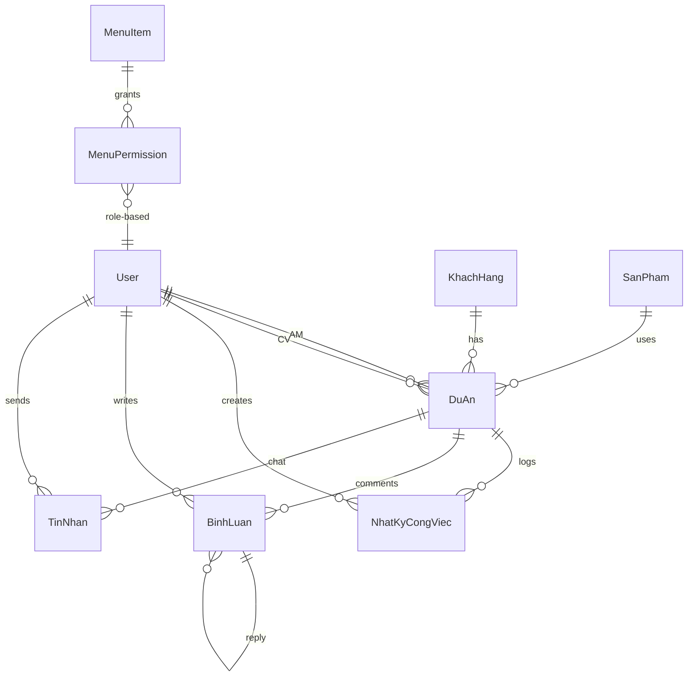

# Database Design — MobiFone Project Tracker
**Version:** 1.4.0 | **Updated:** 2026-04-12  
**ORM:** Prisma v7.6.x | **Database:** Self-hosted sqld (libSQL Server) via Docker

---

## 1. Entity Relationship Diagram



---

## 2. Enums

```prisma
enum UserRole {
  ADMIN        // Quản trị viên (Admin) — Full system access, user management
  USER         // Quản trị viên (Chuyên viên) — Full access, similar to ADMIN
  AM           // Account Manager — Restricted to: Dashboard, CRM, Khách hàng, KPI, Tạo dự án
  CV           // Chuyên viên — Restricted to: Dashboard, CRM, Khách hàng, KPI, Tạo dự án
}

enum PhanLoaiKH {
  CHINH_PHU    // Sở, Ban, Ngành
  DOANH_NGHIEP // Doanh nghiệp tư nhân
  CONG_AN      // Công an (B2A)
}

enum TrangThaiDuAn {
  MOI              // Mới
  DANG_LAM_VIEC    // Đang làm việc
  DA_DEMO          // Đã demo
  DA_GUI_BAO_GIA   // Đã gửi báo giá
  DA_KY_HOP_DONG   // Đã ký hợp đồng
  THAT_BAI         // Thất bại
}

enum LinhVuc {
  CHINH_PHU      // Chính phủ/ Sở ban ngành
  DOANH_NGHIEP   // Doanh nghiệp
  CONG_AN        // Công an
}

enum LoaiTinNhan {
  TEXT       // Tin nhắn văn bản
  SYSTEM     // Tin nhắn hệ thống (status changed, user joined...)
}
```

---

## 3. Table Definitions

### 3.1 User (Nhân viên)

| Field | Type | Constraints | Description |
|-------|------|-------------|-------------|
| id | String | PK, cuid() | Unique identifier |
| name | String | required | Họ tên |
| email | String | unique | Email đăng nhập |
| hashedPassword | String | required | Mật khẩu mã hóa |
| role | UserRole | default: USER | Vai trò |
| diaBan | String? | nullable | Tổ 1, Tổ 2... |
| avatarUrl | String? | nullable | Ảnh đại diện |
| isActive | Boolean | default: true | Trạng thái tài khoản |
| createdAt | DateTime | auto | |
| updatedAt | DateTime | auto | |

**Indexes:** `email`, `role`, `diaBan`

### 3.2 Session (Better Auth)

| Field | Type | Constraints | Description |
|-------|------|-------------|-------------|
| id | String | PK | Session ID |
| userId | String | FK → User | User sở hữu |
| token | String | unique | Session token |
| expiresAt | DateTime | required | Hết hạn |

### 3.3 KhachHang (Khách hàng — Master Data)

| Field | Type | Constraints | Description |
|-------|------|-------------|-------------|
| id | Int | PK, auto | |
| ten | String | required | Sở Y tế, Bệnh viện... |
| phanLoai | PhanLoaiKH | required | Chính phủ / DN / Công an |
| diaChi | String? | nullable | Địa chỉ |
| soDienThoai | String? | nullable | SĐT |
| email | String? | nullable | Email liên hệ |
| dauMoiTiepCan | String? | nullable | Đầu mối tiếp cận |
| soDienThoaiDauMoi | String? | nullable | SĐT Đầu mối |
| ngaySinhDauMoi | DateTime? | nullable | Ngày sinh Đầu mối |
| lanhDaoDonVi | String? | nullable | Lãnh đạo đơn vị |
| soDienThoaiLanhDao | String? | nullable | SĐT Lãnh đạo |
| ngaySinhLanhDao | DateTime? | nullable | Ngày sinh Lãnh đạo |
| ngayThanhLap | DateTime? | nullable | Ngày thành lập |
| ngayKyNiem | DateTime? | nullable | Ngày kỷ niệm |
| ghiChu | String? | nullable | Ghi chú thêm |
| isActive | Boolean | default: true | |

**Indexes:** `phanLoai`, `ten`

### 3.4 SanPham (Sản phẩm — Master Data)

| Field | Type | Constraints | Description |
|-------|------|-------------|-------------|
| id | Int | PK, auto | |
| nhom | String | required | Cloud, IOC, Hóa đơn ĐT... |
| tenChiTiet | String | required | Tên chi tiết |
| moTa | String? | nullable | Mô tả |
| isActive | Boolean | default: true | |

**Indexes:** `nhom`

### 3.5 DuAn (Project Master — CORE)

| ID | Type | Constraints | Description |
|-------|------|-------------|-------------|
| id | Int | PK, auto | |
| customerId | Int | FK → KhachHang | Khách hàng |
| productId | Int | FK → SanPham | Sản phẩm |
| amId | String? | FK → User (SetNull) | AM phụ trách |
| amHoTroId | String? | FK → User (SetNull) | AM Hỗ trợ |
| chuyenVienId | String? | FK → User (SetNull) | Chuyên viên |
| cvHoTro1Id | String? | FK → User (SetNull) | Chuyên viên hỗ trợ 1 |
| cvHoTro2Id | String? | FK → User (SetNull) | Chuyên viên hỗ trợ 2 |
| tenDuAn | String | required | Tên mô tả dự án |
| linhVuc | LinhVuc | default: CHINH_PHU | Lĩnh vực |
| tongDoanhThuDuKien | Float | default: 0 | Triệu đồng |
| doanhThuTheoThang | Float? | default: 0 | Mức doanh thu tháng |
| maHopDong | String? | nullable | Mã hợp đồng |
| ngayBatDau | DateTime | required | Ngày bắt đầu |
| ngayKetThuc | DateTime? | nullable | Ngày kết thúc |
| isTrongDiem | Boolean | default: false | Dự án trọng điểm |
| isPendingDelete | Boolean | default: false | Cờ xóa mềm (Recycle Bin) |
| deleteRequestedAt | DateTime? | nullable | Thời điểm yêu cầu xóa |
| tuan | Int | auto-calc | Week number |
| thang | Int | auto-calc | 1-12 |
| quy | Int | auto-calc | 1-4 |
| nam | Int | auto-calc | Year |
| ngayChamsocCuoiCung | DateTime? | nullable | CSKH cuối |
| trangThaiHienTai | TrangThaiDuAn | default: MOI | Status |

**Indexes:** `customerId`, `productId`, `amId`, `chuyenVienId`, `trangThaiHienTai`, `linhVuc`, `(nam,quy,thang)`, `ngayChamsocCuoiCung`

### 3.6 NhatKyCongViec (Task Detail — DETAIL)

| Field | Type | Constraints | Description |
|-------|------|-------------|-------------|
| id | Int | PK, auto | |
| projectId | Int | FK → DuAn, CASCADE | Dự án cha |
| userId | String | FK → User, CASCADE | Người tạo |
| ngayGio | DateTime | default: now() | Thời điểm |
| trangThaiMoi | TrangThaiDuAn | required | Trạng thái mới |
| noiDungChiTiet | String | required | Nội dung chi tiết |

> **⚡ Trigger:** Tạo NhatKyCongViec → cập nhật `DuAn.ngayChamsocCuoiCung` + `DuAn.trangThaiHienTai`

### 3.7 BinhLuan (Comments — Thread)

| Field | Type | Constraints | Description |
|-------|------|-------------|-------------|
| id | Int | PK, auto | |
| projectId | Int | FK → DuAn, CASCADE | Dự án |
| userId | String | FK → User, CASCADE | Người viết |
| content | String | required | Nội dung |
| parentId | Int? | FK → BinhLuan (self) | Reply thread |

### 3.8 TinNhan (Chat Message — Real-time)

| Field | Type | Constraints | Description |
|-------|------|-------------|-------------|
| id | Int | PK, auto | |
| projectId | Int | FK → DuAn, CASCADE | Dự án (chat channel) |
| userId | String | FK → User, CASCADE | Người gửi |
| content | String | required | Nội dung tin nhắn |
| type | LoaiTinNhan | default: TEXT | Loại tin nhắn (TEXT/SYSTEM) |
| isEdited | Boolean | default: false | Đã sửa? |
| isDeleted | Boolean | default: false | Đã xóa mềm? |
| createdAt | DateTime | auto | Thời điểm gửi |
| updatedAt | DateTime | auto | Thời điểm cập nhật |

**Indexes:** `(projectId, createdAt)` (compound — phục vụ cursor pagination), `userId`

> **📝 Note:** `TinNhan` khác `BinhLuan` ở chỗ: TinNhan là chat liên tục dạng messenger (flat, không thread), còn BinhLuan là threaded discussion theo chủ đề.

### 3.9 ChiTieuKpi (KPI Tracker)

| Field | Type | Constraints | Description |
|-------|------|-------------|-------------|
| id | Int | PK, auto | |
| nam | Int | required | Năm |
| thang | Int | required | Tháng |
| anNinhMang | Float | default: 0 | Mục tiêu An Ninh Mạng |
| giaiPhapCntt | Float | default: 0 | Mục tiêu Giải pháp CNTT |
| duAnCds | Float | default: 0 | Mục tiêu Dự án CĐS |
| cnsAnNinh | Float | default: 0 | Mục tiêu CNS An Ninh |
| createdAt | DateTime | auto | |
| updatedAt | DateTime | auto | |

**Indexes:** `nam`, `(nam, thang)` (unique)

### 3.10 RBAC — Current Implementation (Static Config)

The current RBAC system uses a static configuration file (`src/lib/rbac.ts`) rather than database tables. Roles are stored as the `role` field on the `User` table, and route-to-role mappings are defined in code:

```typescript
// src/lib/rbac.ts — Route permission config
export type AppRole = "ADMIN" | "USER" | "AM" | "CV";

export const ROUTE_PERMISSIONS: RoutePermission[] = [
  { pattern: "/",               roles: ["ADMIN", "USER", "AM", "CV"] },
  { pattern: "/du-an",          roles: ["ADMIN", "USER", "AM", "CV"] },
  { pattern: "/admin/khach-hang", roles: ["ADMIN", "USER", "AM", "CV"] },
  { pattern: "/admin/kpi",      roles: ["ADMIN", "USER", "AM", "CV"] },
  { pattern: "/kpi",            roles: ["ADMIN", "USER"] },
  { pattern: "/dia-ban",        roles: ["ADMIN", "USER"] },
  { pattern: "/admin/users",    roles: ["ADMIN", "USER"] },
  // ...more routes
];
```

**Role Metadata** is also stored in `rbac.ts` with labels, descriptions, and badge colors for UI rendering.

### 3.11 RBAC — Database Models (Dynamic Role Management)

The application uses dynamic, admin-configurable role permissions without code changes, incorporating the following models:

#### MenuItem (Registry of all menu/routes)

| Field | Type | Constraints | Description |
|-------|------|-------------|-------------|
| id | Int | PK, auto | |
| key | String | unique | Identifier, e.g. "dashboard", "crm-du-an" |
| label | String | required | Display name, e.g. "Dashboard Tổng quan" |
| href | String | required | Route path, e.g. "/" |
| icon | String? | nullable | Lucide icon name |
| section | String | default: "main" | "main" or "admin" |
| sortOrder | Int | default: 0 | Display order |
| isActive | Boolean | default: true | Active/inactive toggle |
| createdAt | DateTime | auto | |
| updatedAt | DateTime | auto | |

**Indexes:** `(section, sortOrder)`

#### MenuPermission (Join table: Role ↔ MenuItem)

| Field | Type | Constraints | Description |
|-------|------|-------------|-------------|
| id | Int | PK, auto | |
| role | String | required | "ADMIN", "USER", "AM", "CV" |
| menuItemId | Int | FK → MenuItem, CASCADE | Linked menu |
| createdAt | DateTime | auto | |

**Indexes:** `(role, menuItemId)` (unique)

#### RoleConfig (Role metadata in DB)

| Field | Type | Constraints | Description |
|-------|------|-------------|-------------|
| id | Int | PK, auto | |
| role | String | unique | Role key |
| label | String | required | Vietnamese display name |
| description | String? | nullable | Role description |
| badgeColor | String? | nullable | Tailwind class |
| textColor | String? | nullable | Tailwind class |
| borderColor | String? | nullable | Tailwind class |
| isSystem | Boolean | default: false | Cannot be deleted |
| createdAt | DateTime | auto | |
| updatedAt | DateTime | auto | |

---

## 4. Business Rules

### 4.1 Auto-extract Time Fields
```typescript
import { getWeek, getMonth, getQuarter, getYear } from "date-fns";

export function extractTimeFields(date: Date) {
  return {
    tuan: getWeek(date, { weekStartsOn: 1 }),
    thang: getMonth(date) + 1,
    quy: getQuarter(date),
    nam: getYear(date),
  };
}
```

### 4.2 Task Log → Update Parent (Transaction)
```typescript
async function createTaskLog(data: TaskLogInput) {
  return prisma.$transaction([
    prisma.nhatKyCongViec.create({ data: { ...data, ngayGio: data.ngayGio ?? new Date() } }),
    prisma.duAn.update({
      where: { id: data.projectId },
      data: {
        ngayChamsocCuoiCung: data.ngayGio ?? new Date(),
        trangThaiHienTai: data.trangThaiMoi,
      },
    }),
  ]);
}
```

### 4.3 Smart Alert — 15-Day Rule
```typescript
import { differenceInDays } from "date-fns";

export function isNeedsCare(lastCare: Date | null): boolean {
  if (!lastCare) return true;
  return differenceInDays(new Date(), lastCare) > 15;
}
```

---

## 5. Migration Strategy

### 5.1 Development (via Cloudflare Tunnel → sqld)
```bash
# Local dev connects to self-hosted sqld through Cloudflare Tunnel
# DATABASE_URL=https://turso.gpsdna.io.vn
npx prisma migrate dev --name init
npx prisma db push
```

### 5.2 Production (Internal Docker Network → sqld)
```bash
# Production web container connects internally
# DATABASE_URL=http://sqld:8080
npx prisma migrate deploy
```

### 5.3 Self-Hosted sqld Architecture

Cả production và development đều sử dụng **self-hosted sqld (libSQL Server)** chạy trong Docker Compose. sqld được bảo vệ bởi JWT authentication (Ed25519).

| Aspect | Detail |
|--------|--------|
| **Database Engine** | sqld (libSQL Server) — Docker container |
| **Data Storage** | Docker named volume `sqld-data` → `/var/lib/sqld` |
| **Prod Connection** | `http://sqld:8080` (internal Docker network, < 1ms) |
| **Dev Connection** | `https://turso.gpsdna.io.vn` (Cloudflare Tunnel, ~50-100ms) |
| **Authentication** | Ed25519 JWT tokens (mandatory for all connections) |
| **Database Separation** | `default` namespace (prod) + `dev` namespace (dev) |
| **Reads/Writes** | Direct HTTP to sqld container |
| **Connection Protocol** | Stateless HTTP — no WebSocket/Hrana issues |
| **Cost** | $0 (self-hosted on existing VPS) |

**Environment Variables (Production — Docker `web` container):**
```env
DATABASE_URL="http://sqld:8080"              # Internal Docker network
TURSO_DATABASE_URL="http://sqld:8080"        # Internal Docker network
TURSO_AUTH_TOKEN="<prod-jwt-token>"          # Ed25519 signed JWT
```

**Environment Variables (Development — Local machine):**
```env
DATABASE_URL="https://turso.gpsdna.io.vn"    # Cloudflare Tunnel → sqld
TURSO_DATABASE_URL="https://turso.gpsdna.io.vn"  # Cloudflare Tunnel → sqld
TURSO_AUTH_TOKEN="<dev-jwt-token>"           # Ed25519 signed JWT
```

**Client Configuration:**
```typescript
import { createClient } from "@libsql/client";

// Works for both prod (http://sqld:8080) and dev (https://turso.gpsdna.io.vn)
const libsqlClient = createClient({
  url: process.env.TURSO_DATABASE_URL!,
  authToken: process.env.TURSO_AUTH_TOKEN!,
});
```

**Consistency Model:**

| Scenario | Behavior |
|----------|----------|
| Single-writer (prod web container) | Fully consistent (single sqld instance) |
| Dev vs Prod | Separate database namespaces — no cross-contamination |
| Chat messages | Real-time qua Ably — không phụ thuộc DB sync |
| System Logs | File System (`logs/app.log`) bằng Pino — không lưu trong DB |

### 5.4 Database Sync (Dev ↔ Prod)

Built-in scripts allow controlled data flow between dev and prod namespaces:

```
┌─────────────────┐                    ┌─────────────────┐
│  PROD (default)  │ ── sync ────────▶ │  DEV             │
│  namespace       │ ◀── promote ──── │  namespace       │
└─────────────────┘                    └─────────────────┘
```

| Command | Direction | Use Case |
|---------|-----------|----------|
| `pnpm db:sync:prod-to-dev` | Prod → Dev | Seed dev with real prod data for testing |
| `pnpm db:sync:dev-to-prod` | Dev → Prod | Promote tested schema/data changes to production |
| `pnpm db:backup` | Any namespace | Create point-in-time SQL dump |

**Safety rules:**
1. Prod → Dev always overwrites dev (with confirmation prompt)
2. Dev → Prod always creates auto-backup first, requires double confirmation
3. Schema-only mode (`--schema-only`) runs `prisma migrate deploy` without touching data
4. Data-only mode (`--data-only`) copies rows without schema changes

### 5.5 JWT Key Management

Keys are stored in `sqld-keys/` within the project root (all `*.pem` files are gitignored). The public key is synced to GitHub Actions Secrets as `SQLD_JWT_PUBLIC_KEY` and written to the server during `deploy.yml` execution.

```
Developer Laptop                    GitHub Secrets             Server
sqld-keys/*.pem (gitignored)   →   SQLD_JWT_PUBLIC_KEY   →   sqld-keys/sqld_jwt_public.pem
generate-token.ts              →   TURSO_AUTH_TOKEN       →   .env (prod token)
```

---

## 6. Seed Data

Sample seed includes:
- 1 Admin + 1 USER + AM/CV users with different `diaBan` and roles
- 6 Khách hàng (mix Chính phủ, DN, Công an)
- 6 Sản phẩm (Cloud, IOC, Camera AI, mInvoice...)
- 3 Dự án mẫu with varied statuses
- 5 NhatKyCongViec entries forming a timeline
- 3 BinhLuan entries with reply thread

**Implemented Dynamic RBAC:**
- MenuItem seed: all sidebar routes registered in the MenuItem table, supports `isActive` toggles and `sortOrder`.
- MenuPermission seed: default role-menu assignments mapped directly to UI (Matrix).
- RoleConfig seed: system roles with Vietnamese labels and configurable metadata.
